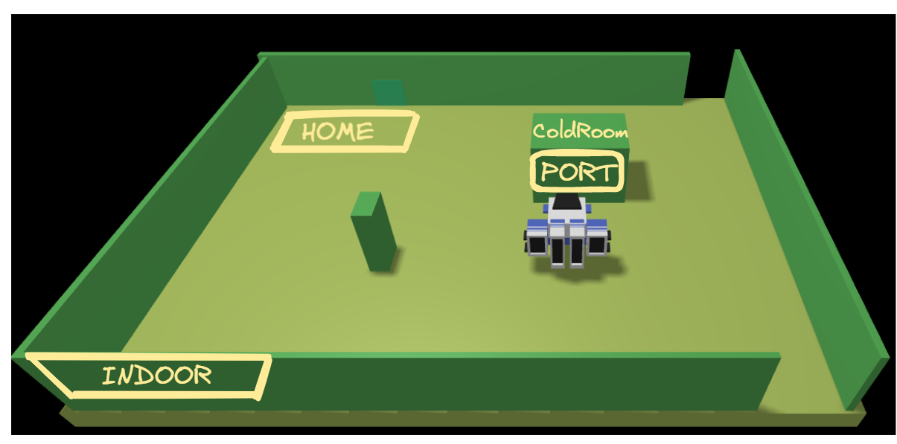

# Robot commanded by a server using QAktor system (DLS based on Kotlin) - deployed on RaspBerry Pi 4B / 3B+
⚠️⚠️⚠️ REPOSITORY UNDER CONSTRUCTION ⚠️⚠️⚠️

# Delivery
A company intends to build a ColdStorageService, composed of a set of elements:

1. a service area (rectangular, flat) that includes:
    - an INDOOR port, to enter food (fruits, vegetables, etc. ).
    - a ColdRoom container, devoted to store food, upto MAXW kg.

    The ColdRoom is positioned within the service area, as shown in the following picture:



2. a DDR robot working as a transport trolley, that is intially situated in its HOME location. The transport trolley has the form of a square of side length RD.

    The transport trolley is used to perform a deposit action that consists in the following phases:

    -  pick up a food-load from a Fridge truck located on the INDOOR
    - go from the INDOOR to the PORT of the ColdRoom
    - deposit the food-load in the ColdRoom

3. a ServiceAcessGUI that allows an human being to see the current current weigth of the material stored in the ColdRoom and to send to the ColdStorageService a request to store new FW kg of food. If the request is accepted, the services return a ticket that expires after a prefixed amount of time (TICKETTIME secs) and provides a field to enter the ticket number when a Fridge truck is at the INDOOR of the service.

4. a ServiceStatusGUI that allows a Service-manager (an human being) to supervises the state of the service.

## Alarm Requirement
The system includes a Sonar and a Led connected to a RaspnerryPi.

The Sonar is used as an ‘alarm device’: when it measures a distance less that a prefixed value DLIMT, the transport trolley must be stopped; it will be resumed when Sonar detects again a distance higher than DLIMT.

The Led is used as a warning devices, according to the following scheme:

- the Led is off when the transport trolley is at HOME
- the Led blinks while the transport trolley is moving
- the Led is on when transport trolley is stopped.

## Service User Story
The story of the ColdStorageService can be summarized as follows:

- A Fridge truck driver uses the ServiceAcessGUI to send a request to store its load of FW kg. If the request is accepted, the driver drives its truck to the INDOOR of the service, before the ticket exipration time TICKETTIME.

- When the truck is at the INDOOR of the service, the driver uses the ServiceAcessGUI to enter the ticket number and waits until the message charge taken (sent by the ColdStorageService) appears on the ServiceAcessGUI. At this point, the truck should leave the INDOOR.

- When the service accepts a ticket, the transport trolley reaches the INDOOR, picks up the food, sends the charge taken message and then goes to the ColdRoom to store the food.

- When the deposit action is terminated, the transport trolley accepts another ticket (if any) or returns to HOME.

- While the transport trolley is moving, the Alarm requirements should be satisfied. However, the transport trolley should not be stopped if some prefixed amount of time (MINT msecs) is not passed from the previous stop.

- A Service-manager migtht use the ServiceStatusGUI to see:
    - the current state of the transport trolley and it position in the room;
    - the current weigth of the material stored in the ColdRoom;
    - the number of store-requests rejected since the start of the service.


##### Table of Contents  
[Install](#install)  
[Usage](#usage)  
[File Details](#file-details)  
[Bill Of Materials](#bill-of-materials)  
[Troubleshooting](#troubleshooting)  


# Install and Usage
## Basic Robot
### **Use Virtual Robot**
The virtual robot was developed by was developed by [Pierfrancesco Soffritti](https://pierfrancescosoffritti.com/).
To correctly launch the virtual system:

1. Clone the repository and go to ```it.unibo.virtualRobot2023``` folder
    ```bash
    git clone https://github.com/RootLeo00/robot-coldstorage.git
    cd it.unibo.virtualRobot2023
    ```

2. Run docker-compose
   ```bash
    sudo docker-compose -f virtualRobot23.yaml up
   ```

### **Build the Real Robot**

### Bill Of Materials
- Raspberry PI 4B / 3B+
- 2 Trolley Chassis
- 4 Micro DC Motor (Geared) - 90 RPM (6-12V)
- 4 wheels
- L298N Dual H-Bridge Motor Controller
- Ultrasonic Sensor - HC-SR04 (Sonar)
- Jumper wires MM / FM / FF
- USB-C wire
- Cooling Fan
- Power Bank 5200mAh
- 4 batteries AA (1.5 V)
- 1 LED
- Resistors (1kohm, 2 kohm, 100 ohm)

Follow the instruction on the Deployment section of the final report.

More detailed instructions are written on the [original robot project repository](https://github.com/RootLeo00/robot-wheelly-object-detection).

Note: the original robot project has a camera and a servo that are not required for this project. Instead, the original robot project does not have a led that is required for this project.

### Install the software
1. Clone this repository
```bash
git clone https://github.com/RootLeo00/robot-coldstorage.git
```
2. Download requirements
```bash
cd robot-coldstorage
chmod +x setup.sh
./setup.sh
```

3. Start by running docker-compose
```bash
cd unibo.basicrobot23
sudo docker-compose -f basicrobot23.yaml up
```

## ServiceAccessGUI Application
1. Clone this repository
```bash
git clone https://github.com/RootLeo00/robot-coldstorage.git
```
2. Download requirements
```bash
cd robot-coldstorage
chmod +x setup.sh
./setup.sh
```

3. Start ...
```bash
```


# Cold Storage Service Application
1. Clone this repository
```bash
git clone https://github.com/RootLeo00/robot-coldstorage.git
```
2. Download requirements
```bash
cd robot-coldstorage
chmod +x setup.sh
./setup.sh
```

3. Start ...
```bash
```


# File details
```
├──  sprint0  
│    └── ...
|
├──  sprint1  
│    └── ...
|
├──  sprint2  
│    └── ...
|
├──  sprint3  
│    └── ...
|
├──  userDocs  
│    └── ...
|
├──  updatemain.sh  
```

# Troubleshooting
1. Wheels or sonar don't work
   
   Try to run their specific tests. You can find the tests in ```/test``` folder.
